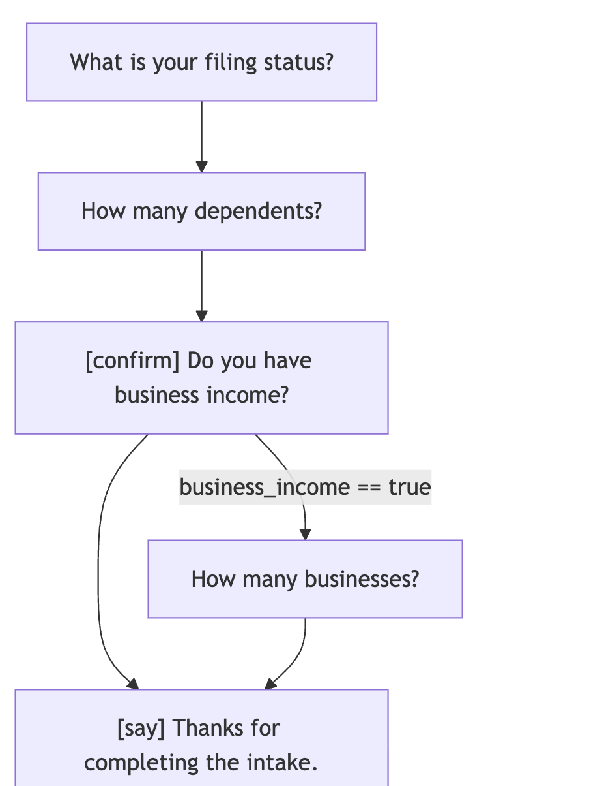

# Examples

This folder contains just a couple examples to demonstrate the API and the functionality.

For a fuller list of more comprehensive examples, please see the [examples in the `inquirex-tty` gem](https://github.com/inquirex/inquirex-tty/tree/main/examples).

## Running Examples

These examples are meant to be run as executables from the root level of the gem folder.

### First Example

This example should print to stdout the DSL definition in JSON:

```bash
# First example — creates a DSL definition and prints it to stdout in JSON format
./examples/01_readme_example.rb | jq
```

### Second Example

This is a more interesting example. It builds on the first, takes that definition and uses the mermaid converter to write a tiny HTML file with a mermaid diagram inside, which represents the definition defined in the first file.

```bash
# creates a mermaid.html file at the root of the project
# opens the browser with the file and waits 10 seconds
# deletes the HTML file and exits
./examples/02_readme_mermaid.rb
```

The mermaid file generated should look like this:

</img>

### Third Example

Declares completion emails with the top-level `send_email` verb (block-builder and inline keyword forms, with an `if:` gate), selects the applicable ones for a set of answers, builds `Mail::Message` objects via `#to_mail`, and demonstrates the JSON round-trip:

```bash
./examples/03_send_email.rb
```
